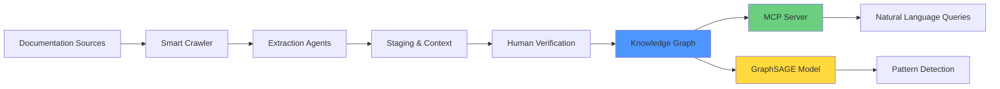

# PROVES Library

> Structured knowledge extraction and preservation for satellite development programs

[](https://lizo-roadtown.github.io/PROVES_LIBRARY/)
[](https://www.python.org/downloads/)
[](LICENSE)

---

## The Problem

Satellite development requires stable, reliable knowledge. Engineers need to know:

- What actually works (not just what the spec says)
- Why decisions were made
- What's been tried and failed
- What depends on specific conditions

But knowledge degrades:

- Experienced people leave, taking context with them
- Documentation says "what" but not "why" or "how confident to be"
- Lessons learned sit in reports nobody reads
- New engineers can't tell what's reliable vs. what's a guess

**Result:** Steep learning curves, repeated mistakes, and failures that could have been prevented.

---

## The Solution

This library provides structured knowledge extraction and preservation for technical systems, initially focused on CubeSat development with F´ and PROVES Kit.

**Core capability:** Extract knowledge from documentation, tag it with context (where it came from, how reliable it is, what it depends on), and make it queryable so engineers can access stable information across personnel transitions.

**Key features:**

- Natural language queries via MCP server ("What do we know about the MS5611 barometer?")
- Pattern recognition via GraphSAGE neural network (detect hidden couplings, predict cascade risks)
- Full provenance tracking (every piece of knowledge traces back to source)
- Human verification layer (engineers confirm what agents extract)

---

> **📊 System Self-Analysis: Meta-Learning in Action**
>
> The agentic system analyzes its own extraction quality and graph structure. This is the first meta-analysis report generated by the system observing itself - examining database state, extraction patterns, and identifying what needs improvement.
>
> → **[View Latest Progress Report](testing_data/progress_diagrams/latest.md)** - Generated 2025-12-28

---

## How It Works

### 1. Intelligent Source Discovery

```bash
python production/scripts/find_good_urls.py --fprime --proveskit --max-pages 50
```

Smart crawler analyzes documentation quality, identifies high-signal pages, queues for extraction.

### 2. Autonomous Knowledge Extraction

```bash
python production/scripts/process_extractions.py --limit 10
```

Multi-agent system extracts:

- **Components**: Discrete modules (drivers, sensors, boards)
- **Interfaces**: Connection points (I2C bus, SPI, power rails)
- **Flows**: What moves through interfaces (data, power, commands, heat)
- **Dependencies**: What relies on what, under which conditions

Every extraction includes:

- Source reference (documentation URL, line number)
- Context (why this matters, what it depends on)
- Confidence level (verified, likely, assumed)
- Dimensional metadata (how knowledge was obtained, how reliable it is)

### 3. Human Verification

Extracted knowledge appears in Notion for engineer review:

- Agents provide context and confidence scores
- Engineers verify, correct, or reject
- Only verified knowledge enters the accessible graph

**Why this matters:** Systems built on verified engineering knowledge, not agent guesses.

### 4. Natural Language Access (MCP Server)

Query the knowledge graph using natural language:

```python
# Ask questions in plain language
agent = create_agent("claude-sonnet-4-5-20250929", mcp_tools)
result = await agent.ainvoke({
    "messages": [{"role": "user", "content": "What conflicts with the MS5611 barometer?"}]
})
```

**Multi-layer queries:**

- Content: "Show me all interface requirements for the power system"
- Structure: "What knowledge came from direct testing vs. models?"
- Provenance: "Trace this dependency back to source documentation"

→ **[MCP Integration Guide](docs/MCP_INTEGRATION.md)** | **[Quick Start](examples/quick_start_mcp.py)**

### 5. Pattern Recognition (GraphSAGE Neural Network)

Beyond queries, the system learns patterns:

- Predict cascade failures (if power drops, what else fails?)
- Detect hidden couplings (unexpected dependencies between subsystems)
- Suggest testing priorities (which interfaces are most critical?)

**Currently in development:** Graph embedding and neural network training pipeline

→ **[GraphSAGE Implementation](https://github.com/Lizo-RoadTown/Proves_AI)**

### 6. Meta-Learning Improvement

```bash
python production/scripts/improvement_analyzer.py
```

System analyzes its own extraction quality:

- Which sources yield reliable data?
- What extraction patterns lead to verification failures?
- How can the ontology adapt to actual system structure?

**The system improves itself** by learning what works.

---

## Current Status

### Phase 1: Foundation ✅ Complete

- Multi-agent extraction pipeline operational
- Smart documentation crawler
- Full lineage tracking
- Human verification via Notion integration
- Meta-learning analyzer

**Results:**

- 45+ verified dependencies extracted
- 4 critical cross-system gaps discovered
- 23 high-quality pages queued
- Extraction methodology improving through meta-learning

### Phase 2: Access Layer 🚧 In Progress

- MCP server for natural language queries
- Knowledge graph embedding
- Pattern recognition preparation

### Phase 3: Intelligence Layer 📋 Planned

- GraphSAGE model training
- Cascade risk prediction
- Hidden coupling detection

---

## Architecture: Agents → Verification → Access



**Key principle:** Agents extract and categorize. Humans establish truth. Systems provide access.

---

## Knowledge Structure

Based on **FRAMES methodology** (Osborn, 2025):

- **Components**: Discrete modules (what exists)
- **Interfaces**: Connection points (where they connect)
- **Flows**: What moves through interfaces (data, power, heat)
- **Mechanisms**: What maintains connections (protocols, documentation, procedures)

Every relationship captures:

1. **Directionality**: Does it flow both ways?
2. **Strength**: Always, sometimes, never?
3. **Mechanism**: Electrical, thermal, timing, protocol?
4. **Knownness**: Verified, assumed, unknown?
5. **Scope**: Under which conditions? (version, hardware revision, mode)

This structure enables both **precise queries** and **pattern learning**.

---

> **📐 Knowledge Alignment Framework**
>
> When you're building satellites, knowledge comes from everywhere: technicians who've worked on hardware for years, software specs, telemetry data, lessons learned from past missions.
>
> This project tracks where knowledge came from and what it depends on, so people and AI systems know how to read it, track it, and how much to trust it.
>
> **Domains stay different** — Knowledge becomes comparable — **Loss becomes traceable**
>
> → **[Read the full Knowledge Alignment Framework](canon/KNOWLEDGE_FRAMEWORK.md)**

---

## Quickstart

### Prerequisites

```bash
# Python 3.11+
python --version

# PostgreSQL (cloud database recommended)
# Anthropic API key (for extraction agents)
# Notion API key (for verification interface)
```

### Setup

```bash
# Clone repository
git clone https://github.com/Lizo-RoadTown/PROVES_LIBRARY.git
cd PROVES_LIBRARY

# Install dependencies
pip install -r requirements.txt

# Configure environment
cp .env.example .env
# Add: NEON_DATABASE_URL, ANTHROPIC_API_KEY, NOTION_API_KEY
```

### Run the Pipeline

```bash
# 1. Find high-quality documentation
python production/scripts/find_good_urls.py

# 2. Extract knowledge (autonomous agents)
python production/scripts/process_extractions.py

# 3. Verify extractions in Notion
# Visit your Notion workspace → PROVES Library databases

# 4. Query the knowledge graph
python examples/quick_start_mcp.py

# 5. Analyze and improve extraction quality
python production/scripts/improvement_analyzer.py
```

---

## Who This Is For

### CubeSat Development Teams

- University space labs managing student turnover
- Small commercial teams with limited staffing
- Programs using F´, PROVES Kit, or similar frameworks

### Systems Engineers

- Anyone analyzing complex technical dependencies
- Teams that need to preserve knowledge across transitions
- Programs where learning curves are steep and mistakes costly

### Researchers

- ML applications to technical knowledge
- Graph neural networks on engineering systems
- Knowledge preservation in rapidly evolving domains

---

## Documentation

- [Architecture](docs/architecture/AGENTIC_ARCHITECTURE.md) - System design
- [Knowledge Framework](canon/KNOWLEDGE_FRAMEWORK.md) - Theoretical foundation
- [Knowledge Graph Schema](docs/architecture/KNOWLEDGE_GRAPH_SCHEMA.md) - Data model
- [MCP Integration](docs/MCP_INTEGRATION.md) - Natural language queries
- [Production README](production/README.md) - How to run the curator
- [Notion Setup](production/docs/NOTION_INTEGRATION_GUIDE.md) - Human verification

### Visualizations

- [Dependency Overview](docs/diagrams/overview.md)
- [Cross-System Dependencies](docs/diagrams/cross-system.md)
- [Knowledge Gaps](docs/diagrams/knowledge-gaps.md)
- [Team Boundaries](docs/diagrams/team-boundaries.md)
- [Transitive Chains](docs/diagrams/transitive-chains.md)

---

## Design Principles

From [canon/CANON.md](canon/CANON.md):

### 1. Human Verification Layer

Agents extract and categorize, but humans establish truth. This separation ensures the knowledge graph reflects verified physics, not LLM hallucinations.

### 2. Truth Layer Architecture

> "Agents provide context. Humans establish truth."

```text
Raw Sources → Agent Capture → Agent Staging → Human Verification → Truth Graph
     ↑              ↑               ↑                ↑
  (all data)   (categorize)    (flag/context)   (align/verify)
```

### 3. Five-Attribute Edge Model

Every relationship has:

1. **Directionality**: Does it flow both ways?
2. **Strength**: Always, sometimes, never?
3. **Mechanism**: Electrical, thermal, timing, protocol, software state?
4. **Knownness**: Known (verified), assumed, unknown, disproved?
5. **Scope**: Version tuple, hardware revision, mission profile?

This granularity lets the GNN learn **conditional dependencies** and **mode-specific behavior**.

---

## Related Projects

- **[Proves_AI](https://github.com/Lizo-RoadTown/Proves_AI)**: GraphSAGE GNN implementation for mission outcome prediction
- **[PROVES Kit](https://docs.proveskit.space/)**: Open-source CubeSat development framework (primary data source)
- **[F´ (F Prime)](https://nasa.github.io/fprime/)**: NASA's flight software framework (secondary data source)

---

## Contributing

This is active research. Contributions welcome in:

- **New data sources**: Identify high-quality technical documentation for extraction
- **Ontology refinement**: Improve FRAMES categorization for your domain
- **GNN architecture**: Enhance GraphSAGE model for cascade prediction
- **Validation tools**: Better lineage verification and quality checks

See [Issues](https://github.com/Lizo-RoadTown/PROVES_LIBRARY/issues) for current work.

---

## Research Foundation

**FRAMES Methodology:**
Osborn, E. (2025). "FRAMES: A Structural Diagnostic for Resilience in Modular University Space Programs."

**Knowledge Canonicalization:**
Based on epistemic preservation theory for organizational knowledge systems.

**GraphSAGE:**
Hamilton, W., Ying, Z., & Leskovec, J. (2017). "Inductive Representation Learning on Large Graphs." NeurIPS.

**NASA GNN Implementation:**
Mehrabian, A. (2025). nasa-eosdis-heterogeneous-gnn (Revision 7e71e62). Hugging Face. [Model Repository](https://huggingface.co/arminmehrabian/nasa-eosdis-heterogeneous-gnn) DOI: 10.57967/hf/6789

**PROVES Kit Framework:**
Pham, M. & Bronco Space Lab. (2025). PROVES Kit - Open-Source CubeSat Development Framework. California State Polytechnic University, Pomona. [Documentation](https://docs.proveskit.space/en/latest/)

**Application Domain:**
CubeSat systems, F´ framework, PROVES Kit hardware stack.

**Key Contributions:**

- Five-attribute edge model for conditional dependencies
- Inference-embodiment boundary framework for chunking strategy
- Full lineage tracking from graph edges to source documentation
- Dual-layer query system (semantic + structural)

---

## License

MIT License - see [LICENSE](LICENSE)

---

## Contact

**Elizabeth Osborn**
eosborn@cpp.edu
California State Polytechnic University, Pomona

---
