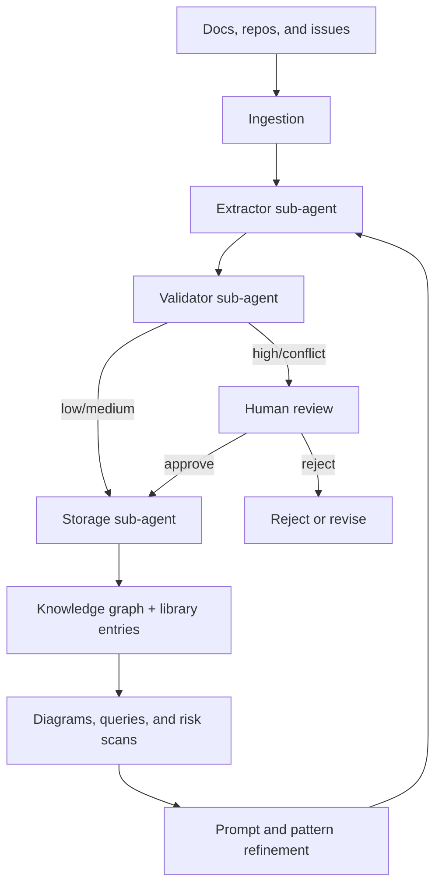
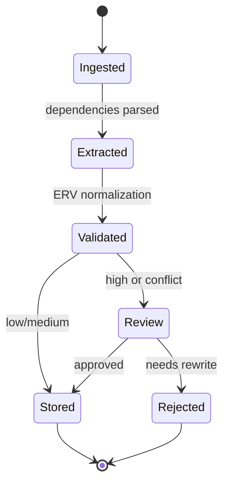

# PROVES Library

Agentic knowledge base for CubeSat mission safety. This repo preserves the
trial dependency mapping between F Prime and PROVES Kit documentation and
hosts the tooling to curate that knowledge into a structured graph.

[](https://lizo-roadtown.github.io/PROVES_LIBRARY/)

## Project snapshot

- Trial mapping complete: FA' I2C driver + PROVES Kit power management docs.
- 45+ dependencies with citations, 4 cross-system dependencies, 5 knowledge gaps.
- Documentation site with interactive Mermaid diagrams in `docs/`.
- Curator agent and graph utilities under active development.

## Agentic system overview

The curator system is a LangGraph-orchestrated workflow that turns raw
documentation into structured knowledge graph entries with traceable sources.
It is designed to surface hidden cross-system dependencies and highlight
mission-critical risks before they cascade across teams.

Core components:

- Curator agent: the coordinator that runs the end-to-end workflow.
- Extractor sub-agent: finds dependencies, constraints, and requirements.
- Validator sub-agent: normalizes output to the ERV schema and checks duplicates.
- Storage sub-agent: writes approved nodes and relationships to the graph.
- Human review loop: required for high-critical items and conflicts.

What the system produces:

- Knowledge graph nodes (components, subsystems, patterns, risks).
- ERV relationships (depends_on, requires, enables, conflicts_with, mitigates, causes).
- Library entries with citations back to source documents.
- Audit trail of decisions and approvals for transparency.

In scope today:

- Dependency extraction from documentation.
- Knowledge gap detection (what is referenced but not documented).
- Cross-system analysis between FA' and PROVES Kit sources.

## Workflow

1. Ingest documentation (trial sources today, automated sync next).
2. Extract candidate dependencies with citations.
3. Validate and normalize into ERV relationships.
4. Gate high-critical items for human approval.
5. Store approved knowledge and update diagrams.

## Lifecycle diagrams

System flow from sources to usable knowledge:



Curator job lifecycle:



## Current focus

- Automate extraction and validation of dependencies.
- Load curated entries into the knowledge graph.
- Improve monitoring and human review workflows.

## Docs site

- Live site: https://lizo-roadtown.github.io/PROVES_LIBRARY/
- Source: `docs/` (Jekyll, TeXt theme)
- Diagrams: `docs/diagrams/*.md`

## How to use

- Read the docs site or open `docs/index.md` locally.
- For the curator agent, see `curator-agent/README.md`.
- For database and graph utilities, see `scripts/`.

## Repository layout

```
PROVES_LIBRARY/
  curator-agent/           LangGraph-based curator agent
  docs/                    GitHub Pages site and diagrams
  library/                 Example knowledge entries
  scripts/                 Database and graph utilities
  trial_docs/              Manual trial analysis sources and results
  archive/                 Superseded code and docs
  requirements.txt         Python dependencies
  FOLDER_STRUCTURE.md      Repository organization
```

## Contributing

Open research project. Issues and improvements welcome. For agent-specific
changes, start with `curator-agent/README.md`.

## License

MIT License - see `LICENSE`.

## Contact

Elizabeth Osborn
Cal Poly Pomona
eosborn@cpp.edu

Portfolio site: https://lizo-roadtown.github.io/proveskit-agent/
