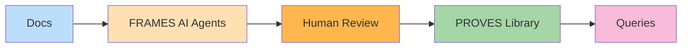

# PROVES Library

**The central knowledge library for PROVES Kit CubeSat development.**

[](https://lizo-roadtown.github.io/PROVES_LIBRARY/)
[](https://www.python.org/downloads/)
[](LICENSE)

---

## What It Is

PROVES Library is the knowledge base for [PROVES Kit](https://docs.proveskit.space/)—the open-source CubeSat development framework built on NASA JPL's [F´ (F Prime)](https://nasa.github.io/fprime/) flight software.

It captures components, dependencies, interfaces, and design decisions so teams can build on verified knowledge instead of starting from scratch.

---

## FRAMES AI by Bronco Space Lab

FRAMES AI is the agentic intelligence system that powers this library. It automates knowledge curation and makes the library queryable.

| Feature | Status | Description |
|---------|--------|-------------|
| **Agentic Extraction** | ✅ Production | AI agents crawl docs and extract knowledge automatically |
| **Curation Dashboard** | ✅ Production | Web UI for teams to review and approve extractions |
| **MCP Server** | ⚠️ Testing | Query the library in natural language |
| **Graph Neural Network** | 🚧 In Progress | Predict cascade failures and hidden dependencies |
| **MBSE Export** | 🚧 In Progress | Export to SysML, XTCE, PyTorch Geometric |

---

## How It Works


```mermaid
flowchart LR
    DOCS[Docs] --> AGENTS[FRAMES AI Agents]
    AGENTS --> REVIEW[Human Review]
    REVIEW --> LIB[PROVES Library]
    LIB --> QUERY[Queries]

    style DOCS fill:#bbdefb
    style AGENTS fill:#ffe0b2
    style REVIEW fill:#ffb74d
    style LIB fill:#a5d6a7
    style QUERY fill:#f8bbd9
```

1. **Agents extract** components and dependencies from PROVES Kit and F´ documentation
2. **Engineers verify** in the curation dashboard
3. **Knowledge enters** the PROVES Library
4. **Teams query** via MCP or export to engineering tools

See the [full architecture diagram](docs/diagrams/frames-ai-overview.md) for details.

---

## Quick Start

```bash
# Clone and setup
git clone https://github.com/Lizo-RoadTown/PROVES_LIBRARY.git
cd PROVES_LIBRARY
pip install -r requirements.txt
cp .env.example .env  # Add your API keys

# Run extraction agents
python production/scripts/find_good_urls.py --fprime --proveskit
python production/scripts/process_extractions.py --limit 10

# Query the library
python mcp-server/examples/quick_start_mcp.py
```

See [Setup Guide](SETUP_GUIDE.md) for full instructions.

---

## Current Stats

- 74 extractions completed
- 29 components identified
- 30 dependencies mapped
- 100% pipeline reliability
- 111 domain model tests passing

---

## Documentation

- [Setup Guide](SETUP_GUIDE.md) - Get started
- [Architecture](docs/architecture/AGENTIC_ARCHITECTURE.md) - How FRAMES AI is built
- [MCP Integration](mcp-server/docs/MCP_INTEGRATION.md) - Query interface
- [Curation Dashboard](curation_dashboard/) - Review extractions
- [Knowledge Framework](canon/KNOWLEDGE_FRAMEWORK.md) - The theory behind FRAMES

---

## Related Projects

- [PROVES Kit](https://docs.proveskit.space/) - Open-source CubeSat framework
- [F´ (F Prime)](https://nasa.github.io/fprime/) - NASA JPL flight software
- [Proves_AI](https://github.com/Lizo-RoadTown/Proves_AI) - Graph neural network training

---

## License

MIT License - see [LICENSE](LICENSE)

---

**Bronco Space Lab** | Cal Poly Pomona
