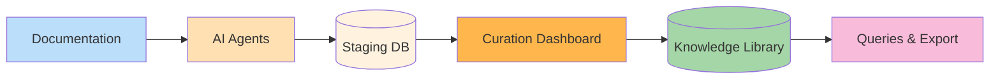
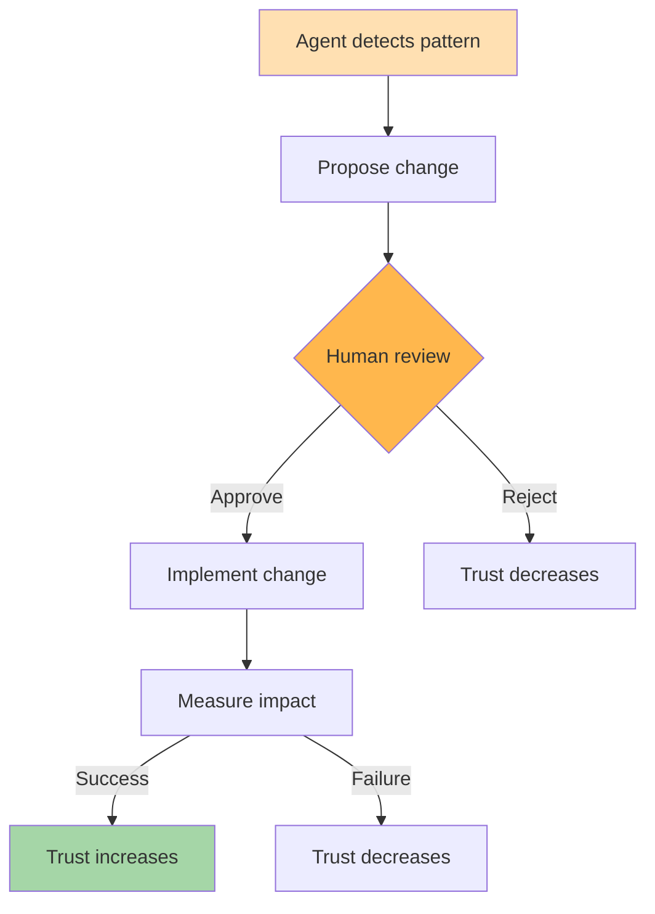

# PROVES Library

An agentic AI system for rapid development and deployment of software in space labs.

[](https://www.python.org/downloads/)
[](LICENSE)
[](https://supabase.com)

---

## What It Does

PROVES Library is the knowledge backbone for [PROVES Kit](https://docs.proveskit.space/), an open-source CubeSat framework built on NASA JPL's [F´ (F Prime)](https://nasa.github.io/fprime/) flight software.

**AI agents automatically extract and organize engineering knowledge:**

1. **Crawl documentation** — PROVES Kit, F´, team repositories
2. **Extract entities** — components, interfaces, dependencies, design decisions
3. **Verify lineage** — ensure evidence exists in source documents
4. **Human review** — engineers approve extractions in the curation dashboard
5. **Query the library** — "What fails if the I2C bus fails?" or "Show all power dependencies"

The agents handle the tedious extraction work. Engineers make the judgment calls.

---

## The Curation Dashboard

The [Curation Dashboard](https://proves-curation-dashboard.vercel.app/) is where engineers review and approve AI-extracted knowledge.

**How it reduces work:**

- **Batch review** — Review dozens of extractions at once instead of manually documenting each one
- **Evidence included** — Every extraction shows the source quote and URL, so you verify instead of research
- **Accept/Reject workflow** — One click to approve good extractions, reject bad ones with a reason
- **Claim system** — Lock extractions while you work on them, prevent duplicate effort
- **Team visibility** — See what teammates are reviewing, track progress across the team

**Dashboard sections:**

| Section | What It Does |
|---------|--------------|
| **Review Work** | Queue of pending extractions needing human approval |
| **Library** | Verified knowledge that passed review |
| **Activity** | Audit trail of all decisions and who made them |
| **Agent Oversight** | Trust calibration for agent self-improvement proposals |
| **Peer Reflection** | Read-only quality metrics (confidence calibration, drift alerts) |

---

## Architecture

```
Documentation → AI Extraction → Human Review → Knowledge Library → Queries
```


```mermaid
flowchart LR
    DOCS[Documentation] --> AGENTS[AI Agents]
    AGENTS --> STAGING[(Staging DB)]
    STAGING --> DASH[Curation Dashboard]
    DASH --> LIB[(Knowledge Library)]
    LIB --> QUERY[Queries & Export]

    style DOCS fill:#bbdefb
    style AGENTS fill:#ffe0b2
    style STAGING fill:#fff3e0
    style DASH fill:#ffb74d
    style LIB fill:#a5d6a7
    style QUERY fill:#f8bbd9
```

| Component | Description | Status |
|-----------|-------------|--------|
| **Extraction Pipeline** | LangGraph agents crawl docs, extract entities and relationships | Production |
| **Curation Dashboard** | Web UI for reviewing and approving extractions | [Live](https://proves-curation-dashboard.vercel.app/) |
| **Knowledge Graph** | PostgreSQL + pgvector for verified entities and relationships | Production |
| **Peer Reflection** | Agents monitor each other's performance and calibration drift | Production |
| **MCP Server** | Natural language queries via Model Context Protocol | Testing |

---

## Quick Start

```bash
# Clone
git clone https://github.com/Lizo-RoadTown/PROVES_LIBRARY.git
cd PROVES_LIBRARY

# Install dependencies
pip install -r requirements.txt

# Configure
cp .env.example .env
# Add your Supabase credentials and Anthropic API key

# Run extraction on PROVES Kit docs
python production/scripts/find_good_urls.py --proveskit
python production/Version\ 3/process_extractions_v3.py --limit 5

# Check what was extracted
python production/scripts/check_pending_extractions.py
```

---

## How Extraction Works

The pipeline uses Claude (via LangGraph) to:

1. **Fetch documentation** and store snapshots with provenance
2. **Extract entities** (components, interfaces, parameters, dependencies)
3. **Verify lineage** — ensure evidence actually exists in source document
4. **Check for duplicates** before storing
5. **Store in staging** for human review

Each extraction includes:
- Source URL and snapshot ID
- Raw evidence quote from documentation
- Confidence score with reasoning
- Epistemic metadata (how the knowledge was derived)

---

## Agentic Self-Improvement

Agents can propose improvements to their own behavior—with human oversight.


```mermaid
flowchart TD
    AGENT[Agent detects pattern] --> PROPOSE[Propose change]
    PROPOSE --> REVIEW{Human review}
    REVIEW -->|Approve| IMPLEMENT[Implement change]
    REVIEW -->|Reject| FEEDBACK[Trust decreases]
    IMPLEMENT --> MEASURE[Measure impact]
    MEASURE -->|Success| TRUST_UP[Trust increases]
    MEASURE -->|Failure| TRUST_DOWN[Trust decreases]

    style AGENT fill:#ffe0b2
    style REVIEW fill:#ffb74d
    style TRUST_UP fill:#a5d6a7
```

Agents can propose:
- **Prompt updates** — Improve extraction/validation prompts
- **Threshold changes** — Adjust confidence thresholds
- **Validation rules** — Add new verification checks
- **Ontology expansion** — Define new entity types

Each agent starts with 0% trust. As proposals are approved and succeed, trust increases. High-trust capabilities can auto-approve without human review.

---

## Peer Reflection

A separate analyzer agent monitors extraction quality without modifying data:

- **Confidence calibration** — Are agents over-confident or under-confident?
- **Drift detection** — Alert when acceptance rates diverge from claimed confidence
- **Entity type performance** — Which extraction types need improvement?
- **Lineage failures** — Track evidence verification issues

The peer reflection dashboard is read-only by design—it observes but never writes.

---

## Technology Stack

| Layer | Technology |
|-------|------------|
| **LLM** | Claude Sonnet 4.5 (Anthropic) |
| **Agent Orchestration** | LangGraph, LangChain |
| **Database** | Supabase (PostgreSQL + pgvector) |
| **Frontend** | React, Vite, Tailwind CSS |
| **Query Interface** | Model Context Protocol (MCP) |
| **Deployment** | Vercel (dashboard), Supabase (database) |

---

## Project Structure

```
PROVES_LIBRARY/
├── production/
│   ├── Version 3/           # Current extraction pipeline
│   │   ├── agent_v3.py      # LangGraph orchestrator
│   │   ├── extractor_v3.py  # Entity extraction agent
│   │   ├── validator_v3.py  # Lineage verification
│   │   └── storage_v3.py    # Database storage
│   ├── core/
│   │   ├── domain/          # Domain models
│   │   └── repositories/    # Database access layer
│   └── scripts/             # CLI tools
├── curation_dashboard/      # React/Vite review interface
├── mcp-server/              # MCP query interface
├── supabase/
│   └── migrations/          # Database schema
└── docs/                    # Documentation
```

---

## Documentation

| Document | Description |
|----------|-------------|
| [Database Setup](docs/SUPABASE_LOCAL_SETUP_WINDOWS.md) | Supabase configuration |
| [Curation Dashboard](docs/CURATION_DASHBOARD_REQUIREMENTS.md) | Review workflow |
| [MCP Server](mcp-server/docs/MCP_SERVER_REQUIREMENTS.md) | Query interface |

---

## Related Projects

- [PROVES Kit](https://docs.proveskit.space/) — Open-source CubeSat framework
- [F´ (F Prime)](https://nasa.github.io/fprime/) — NASA JPL flight software
- [Bronco Space Lab](https://broncospace.cpp.edu/) — Cal Poly Pomona

---

## License

MIT License — see [LICENSE](LICENSE)

---

**Bronco Space Lab** | Cal Poly Pomona
