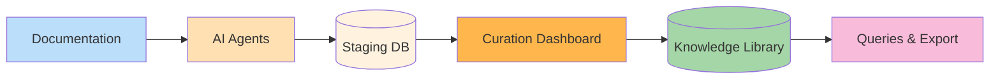

# PROVES Library

A knowledge preservation system for CubeSat development teams.

[](https://www.python.org/downloads/)
[](LICENSE)
[](https://supabase.com)

---

## The Problem

University satellite programs have an 88% failure rate. A major contributor: **knowledge loss during team transitions**. When students graduate, critical understanding of why design decisions were made—what was tried, what failed, what the constraints were—disappears.

The next team starts from scratch, makes the same mistakes, and the cycle repeats.

## What This Does

PROVES Library is the knowledge base for [PROVES Kit](https://docs.proveskit.space/), an open-source CubeSat framework built on NASA JPL's [F´ (F Prime)](https://nasa.github.io/fprime/) flight software.

It works like this:

1. **AI agents crawl documentation** from PROVES Kit, F´, and team repositories
2. **Extract components, dependencies, and design decisions** automatically
3. **Engineers review and verify** in a curation dashboard
4. **Verified knowledge enters the library** and becomes queryable
5. **Teams can ask questions** like "What fails if the I2C bus fails?" or "What are all the power dependencies?"

Only human-verified knowledge enters the library. The agents do the tedious extraction work; engineers make the judgment calls.

---

## Architecture

```
Documentation → AI Extraction → Human Review → Knowledge Library → Queries
```


```mermaid
flowchart LR
    DOCS[Documentation] --> AGENTS[AI Agents]
    AGENTS --> STAGING[(Staging DB)]
    STAGING --> DASH[Curation Dashboard]
    DASH --> LIB[(Knowledge Library)]
    LIB --> QUERY[Queries & Export]

    style DOCS fill:#bbdefb
    style AGENTS fill:#ffe0b2
    style STAGING fill:#fff3e0
    style DASH fill:#ffb74d
    style LIB fill:#a5d6a7
    style QUERY fill:#f8bbd9
```

The system has four main components:

| Component | What It Does | Status |
|-----------|--------------|--------|
| **Extraction Pipeline** | LangGraph agents crawl docs, extract entities and relationships | Production |
| **Curation Dashboard** | Web UI where teams review and approve extractions | Production |
| **Knowledge Graph** | PostgreSQL + pgvector storing verified entities and relationships | Production |
| **MCP Server** | Natural language queries via Model Context Protocol | Testing |

### Database: Supabase

The knowledge graph runs on [Supabase](https://supabase.com) (PostgreSQL):
- Row-level security for multi-team isolation
- pgvector for semantic search
- Real-time subscriptions for live dashboard updates
- Automatic backups

---

## Quick Start

```bash
# Clone
git clone https://github.com/Lizo-RoadTown/PROVES_LIBRARY.git
cd PROVES_LIBRARY

# Install dependencies
pip install -r requirements.txt

# Configure
cp .env.example .env
# Add your Supabase credentials and Anthropic API key

# Run extraction on PROVES Kit docs
python production/scripts/find_good_urls.py --proveskit
python production/Version\ 3/process_extractions_v3.py --limit 5

# Check what was extracted
python production/scripts/check_pending_extractions.py
```

See [docs/SUPABASE_LOCAL_SETUP_WINDOWS.md](docs/SUPABASE_LOCAL_SETUP_WINDOWS.md) for detailed database setup.

---

## Current State

**What's Working:**
- Extraction pipeline processing PROVES Kit and F´ documentation
- 74 extractions completed, 29 components, 30 dependencies mapped
- Curation dashboard for reviewing extractions
- Domain models with standard identifiers (URIs/URNs)
- 111 tests passing

**In Progress:**
- Standards alignment (XTCE, SysML, PyTorch Geometric vocabulary mapping)
- MCP server for natural language queries
- Multi-university team support with authentication

**Planned:**
- Graph neural network for cascade failure prediction
- MBSE export to industry standards

---

## Project Structure

```
PROVES_LIBRARY/
├── production/
│   ├── Version 3/           # Current extraction pipeline
│   │   ├── agent_v3.py      # LangGraph orchestrator
│   │   ├── extractor_v3.py  # Entity extraction agent
│   │   ├── validator_v3.py  # Lineage verification
│   │   └── storage_v3.py    # Database storage
│   ├── core/
│   │   ├── domain/          # Domain models (CoreEntity, RawSnapshot)
│   │   ├── repositories/    # Database access layer
│   │   └── identifiers.py   # URI/URN generation
│   └── scripts/             # CLI tools
├── curation_dashboard/      # React/Vite review interface
├── mcp-server/              # MCP query interface
├── supabase/
│   └── migrations/          # Database schema
├── docs/                    # Architecture documentation
└── .deepagents/             # Development roadmaps
```

---

## How Extraction Works

The extraction pipeline uses Claude (via LangGraph) to:

1. **Fetch documentation** and store snapshots with provenance
2. **Extract entities** (components, interfaces, parameters, dependencies)
3. **Verify lineage** — ensure evidence actually exists in source document
4. **Check for duplicates** before storing
5. **Store in staging** for human review

Each extraction includes:
- Source URL and snapshot ID
- Raw evidence quote from documentation
- Confidence score with reasoning
- Epistemic metadata (how the knowledge was derived)

The validator verifies that extracted evidence actually exists in the source snapshot before accepting it. This prevents hallucinated evidence from entering the system.

---

## Technology Stack

| Layer | Technology |
|-------|------------|
| **LLM** | Claude Sonnet 4.5 (Anthropic) |
| **Agent Orchestration** | LangGraph, LangChain |
| **Database** | Supabase (PostgreSQL + pgvector) |
| **Frontend** | React, Vite, Tailwind CSS |
| **Query Interface** | Model Context Protocol (MCP) |
| **Deployment** | Vercel (dashboard), Supabase (database) |

---

## Documentation

| Document | Description |
|----------|-------------|
| [Database Setup](docs/SUPABASE_LOCAL_SETUP_WINDOWS.md) | Supabase configuration |
| [Curation Dashboard](docs/CURATION_DASHBOARD_REQUIREMENTS.md) | Review workflow requirements |
| [MCP Server](mcp-server/docs/MCP_SERVER_REQUIREMENTS.md) | Query interface specification |
| [Architecture](docs/architecture/AGENTIC_ARCHITECTURE.md) | Technical design |
| [Implementation Roadmap](.deepagents/IMPLEMENTATION_ROADMAP.md) | Current development phase |

---

## Related Projects

- [PROVES Kit](https://docs.proveskit.space/) — Open-source CubeSat framework
- [F´ (F Prime)](https://nasa.github.io/fprime/) — NASA JPL flight software
- [Bronco Space Lab](https://broncospace.cpp.edu/) — Cal Poly Pomona

---

## License

MIT License — see [LICENSE](LICENSE)

---

**Bronco Space Lab** | Cal Poly Pomona
