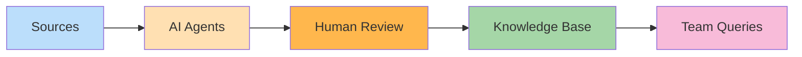

# PROVES Library

An agentic system for teams that move fast. Captures knowledge, creates SOPs, and understands workflows so lean teams can stay focused on building.

[](https://www.python.org/downloads/)
[](LICENSE)
[](https://supabase.com)

---

## What It Does

### Automated Knowledge Capture

Captures your organization's knowledge at multiple levels—both documented and embodied—so nothing gets lost along the way.

- **Scans documentation** — Reads through repos, wikis, and docs to extract components, procedures, and dependencies
- **Listens in meetings** — Captures decisions, action items, and context from team discussions *(in progress)*
- **Updates from correspondence** — Learns from written and verbal communication to keep knowledge current

The system captures what your team knows before it walks out the door.

### Query and Use

Teams interact with captured knowledge through natural language.

- **Answer questions** — "What components depend on the I2C bus?" or "What's the procedure for battery calibration?"
- **Scan your own code** — Point it at your repo to assess risk or check for known failure patterns
- **Source of truth** — Verified knowledge becomes the authoritative reference for processes and procedures
- **Always available** — Organizational knowledge accessible to anyone on the team, anytime

No more digging through Slack threads or asking who knows what.

### SOPs and Workflows

Turns scattered information into structured procedures and maps how your systems connect.

### Predictive Analysis

Neural network and predictive modeling to anticipate issues before they happen. *(planned)*

---

Built for [PROVES Kit](https://docs.proveskit.space/), an open-source CubeSat framework on NASA JPL's [F´](https://nasa.github.io/fprime/) flight software.

---

## How It Works


```mermaid
flowchart LR
    DOCS[Sources] --> AGENTS[AI Agents]
    AGENTS --> REVIEW[Human Review]
    REVIEW --> LIB[Knowledge Base]
    LIB --> QUERY[Team Queries]

    style DOCS fill:#bbdefb
    style AGENTS fill:#ffe0b2
    style REVIEW fill:#ffb74d
    style LIB fill:#a5d6a7
    style QUERY fill:#f8bbd9
```

Agents process your documentation, meetings, and correspondence. Engineers do a quick review to catch errors. Verified knowledge goes into a searchable database your whole team can query.

---

## Components

| Component | Description |
|-----------|-------------|
| **Extraction Pipeline** | LangGraph agents that process documentation |
| **Knowledge Graph** | PostgreSQL + pgvector for entities and relationships |
| **Dashboard** | Web UI for verification ([live](https://proves-curation-dashboard.vercel.app/)) |
| **MCP Server** | Query interface for team questions |

---

## Quick Start

```bash
git clone https://github.com/Lizo-RoadTown/PROVES_LIBRARY.git
cd PROVES_LIBRARY
pip install -r requirements.txt
cp .env.example .env
# Add Supabase credentials and Anthropic API key

python production/scripts/find_good_urls.py --proveskit
python production/Version\ 3/process_extractions_v3.py --limit 5
```

---

## Stack

- **LLM**: Claude (Anthropic)
- **Orchestration**: LangGraph
- **Database**: Supabase (PostgreSQL + pgvector)
- **Frontend**: React, Vite
- **Query**: Model Context Protocol

---

## Built On

- [PROVES Kit](https://docs.proveskit.space/) — Open-source CubeSat framework
- [F´ (F Prime)](https://nasa.github.io/fprime/) — NASA JPL flight software framework
- [Frames AI Research](docs/diagrams/frames-ai-overview.md) — Agentic knowledge capture research

---

## Contact

**Liz Osborn** — eosborn@cpp.edu
**Michael Pham** — mpham@cpp.edu

[Bronco Space Lab](https://broncospace.cpp.edu/) | Cal Poly Pomona

---

MIT License
