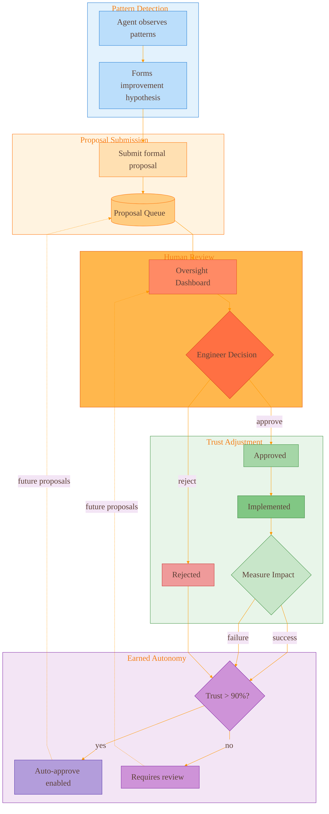
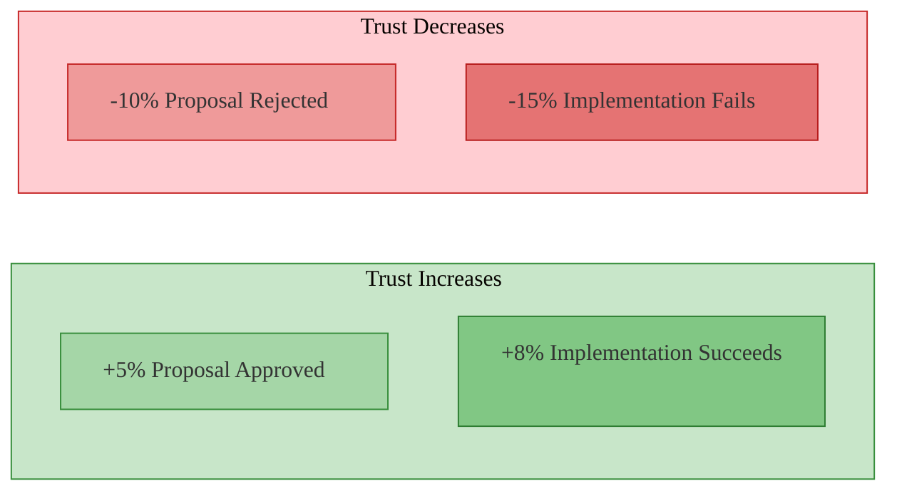
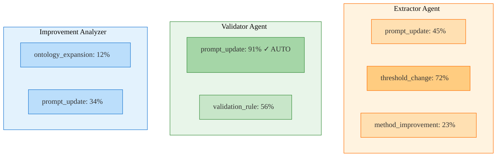
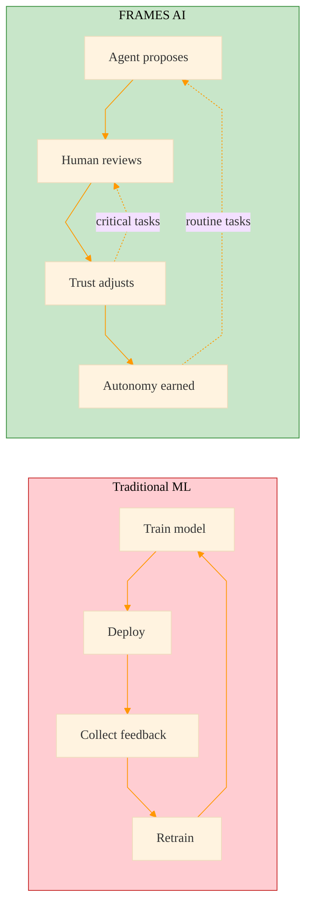

# Agent Self-Improvement

How FRAMES AI agents learn and earn autonomy through trust calibration.

[← Back to Home](../index.html)

---

## Trust Calibration Loop

**What you're looking at:** The complete feedback loop where agents propose improvements, humans review them, and trust adjusts based on outcomes.

---

## The Process

### 1. Pattern Detection
Agent notices something that could be improved during normal operation—a prompt phrase that causes confusion, a threshold that's too strict, a missing validation check.

### 2. Proposal Submission
Agent submits a formal proposal including:
- **Title** — What change is proposed
- **Rationale** — Why this would help
- **Predicted Impact** — Expected improvement
- **Supporting Evidence** — Extraction IDs or patterns that led to this

### 3. Human Review
Engineer sees the proposal in the Oversight Dashboard and decides to approve or reject, with optional notes.

### 4. Trust Adjustment
Based on the decision and implementation outcome, the agent's trust score for that capability adjusts.

### 5. Earned Autonomy
When trust exceeds the threshold (default 90%), that specific capability auto-approves without human review.

---

## Trust Score Changes

| Event | Trust Change | Rationale |
|-------|--------------|-----------|
| Proposal Approved | +5% | Agent's judgment was correct |
| Implementation Succeeds | +8% | Change actually improved the system |
| Proposal Rejected | -10% | Agent misjudged what was needed |
| Implementation Fails | -15% | Approved change caused problems |

The asymmetry (larger penalties for failures) ensures agents are conservative and only propose changes they're confident about.

---

## Per-Capability Trust

Each agent tracks trust **separately** for each capability type. An agent might be trusted for threshold changes but not yet for prompt updates.

The **✓ AUTO** indicates this capability has reached auto-approve threshold (90%) and no longer requires human review.

---

## Capability Types

| Capability | Description | Example Proposal |
|------------|-------------|------------------|
| `prompt_update` | Changes to extraction/validation prompts | "Add check for F´ port naming conventions" |
| `threshold_change` | Adjust confidence thresholds | "Lower threshold for well-documented components" |
| `method_improvement` | Change extraction methodology | "Extract interfaces before components" |
| `validation_rule` | Add new validation checks | "Verify telemetry channel IDs are unique" |
| `ontology_expansion` | Define new entity types | "Add 'Health Check' as component category" |
| `tool_configuration` | Change tool usage patterns | "Use vector search before graph traversal" |

---

## Why This Matters

| Traditional ML | FRAMES AI Self-Improvement |
|----------------|---------------------------|
| Requires retraining | Learns continuously |
| All-or-nothing deployment | Granular per-capability trust |
| Humans label data | Humans approve proposals |
| Fixed after deployment | Improves during operation |
| No audit trail | Full proposal history |

---

**Agents that prove themselves earn autonomy. Those that don't stay supervised.**
