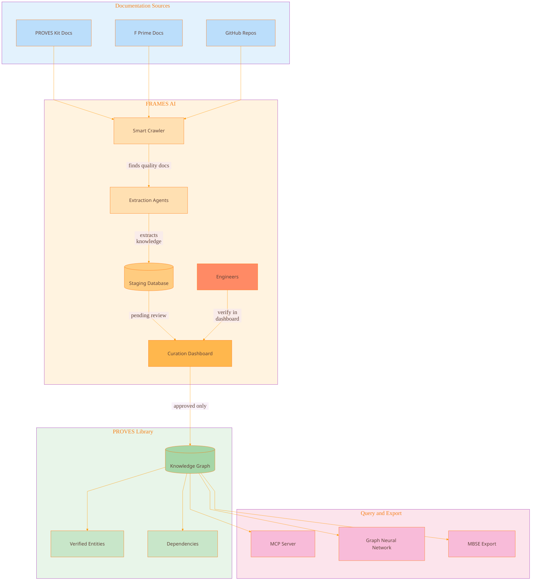
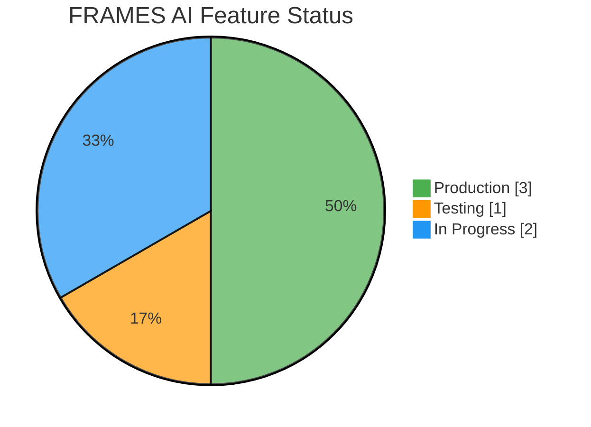
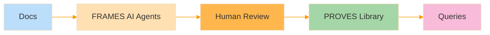

# FRAMES AI Overview

How FRAMES AI powers the PROVES Library.

[← Back to Home](../index.html)

---

## System Architecture

**What you're looking at:** The complete FRAMES AI system showing how documentation becomes queryable knowledge.

---

## The Flow

### 1. Sources
Documentation from PROVES Kit, F Prime, and GitHub repositories.

### 2. FRAMES AI
- **Smart Crawler** finds high-quality documentation pages
- **Extraction Agents** identify components, dependencies, and interfaces
- **Staging Database** holds unverified extractions
- **Curation Dashboard** where engineers review and approve

### 3. PROVES Library
- **Knowledge Graph** stores verified entities and relationships
- Only human-approved knowledge enters the library

### 4. Query and Export
- **MCP Server** for natural language queries
- **Graph Neural Network** for cascade prediction
- **MBSE Export** to SysML, XTCE, PyTorch Geometric

---

## Feature Status

| Feature | Status |
|---------|--------|
| Agentic Extraction | Production |
| Curation Dashboard | Production |
| Multi-Team Support | Production |
| MCP Server | Testing |
| Graph Neural Network | In Progress |
| MBSE Export | In Progress |

---

## Simple View

For a quick mental model:

**Agents extract. Engineers verify. Knowledge stays.**

---

## More Diagrams

- [Agent Self-Improvement](agent-self-improvement.html) — How agents learn and earn autonomy through trust calibration
