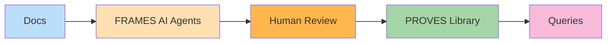

# PROVES Library

**The central knowledge library for PROVES Kit CubeSat development.**

---

## What It Is

PROVES Library is the knowledge base for [PROVES Kit](https://docs.proveskit.space/)—the open-source CubeSat development framework built on NASA JPL's [F´ (F Prime)](https://nasa.github.io/fprime/).

Components, dependencies, interfaces, and design decisions—all in one place.

---

## FRAMES AI by Bronco Space Lab

FRAMES AI is the agentic intelligence system that powers this library.

  

    <h3>Agentic Extraction</h3>
    
AI agents crawl documentation and extract knowledge automatically.

    ✅ Production
  

  

    <h3>Curation Dashboard</h3>
    
Web UI for teams to review, claim, and approve extractions.

    ✅ Production
  

  

    <h3>MCP Server</h3>
    
Query the library in natural language.

    ⚠️ Testing
  

  

    <h3>Graph Neural Network</h3>
    
Predict cascade failures and detect hidden dependencies.

    🚧 In Progress
  

  

    <h3>MBSE Export</h3>
    
Export to SysML, XTCE, PyTorch Geometric.

    🚧 In Progress
  

  

    <h3>Multi-Team Support</h3>
    
Row-level security for university collaboration.

    ✅ Production
  

---

## How It Works

1. **Agents extract** components and dependencies from PROVES Kit and F´ docs
2. **Engineers verify** in the curation dashboard
3. **Knowledge enters** the PROVES Library
4. **Teams query** via MCP or export to engineering tools

[View Full Architecture Diagram](diagrams/frames-ai-overview.html)

---

## Current Stats

| Metric | Value |
|--------|-------|
| Extractions | 74 |
| Components | 29 |
| Dependencies | 30 |
| Pipeline Reliability | 100% |
| Domain Model Tests | 111 passing |

---

## Get Started

- [**Setup Guide**](../SETUP_GUIDE.html) - Install and configure
- [**Curation Dashboard**](../curation_dashboard/) - Review extractions
- [**MCP Integration**](../mcp-server/docs/MCP_INTEGRATION.html) - Query interface

---

## Documentation

- [Architecture](architecture/AGENTIC_ARCHITECTURE.html) - How FRAMES AI is built
- [Knowledge Framework](../canon/KNOWLEDGE_FRAMEWORK.html) - The theory behind FRAMES
- [Knowledge Graph Schema](architecture/KNOWLEDGE_GRAPH_SCHEMA.html) - Data model

---

## Related Projects

- [PROVES Kit](https://docs.proveskit.space/) - Open-source CubeSat framework
- [F´ (F Prime)](https://nasa.github.io/fprime/) - NASA JPL flight software
- [Proves_AI](https://github.com/Lizo-RoadTown/Proves_AI) - Graph neural network training
